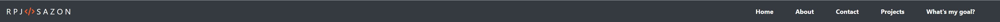
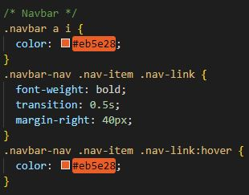
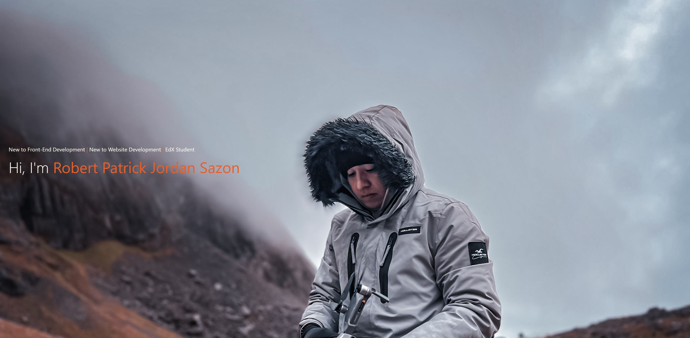
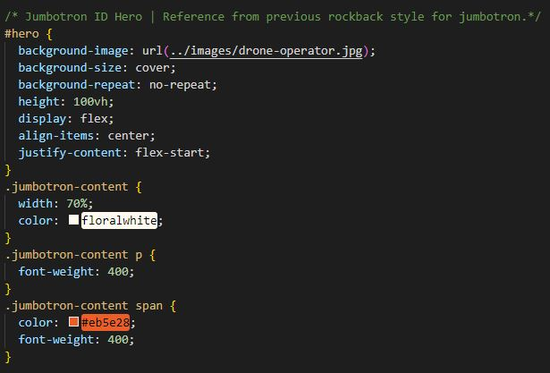
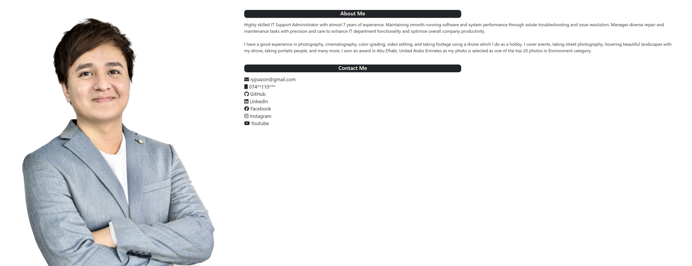
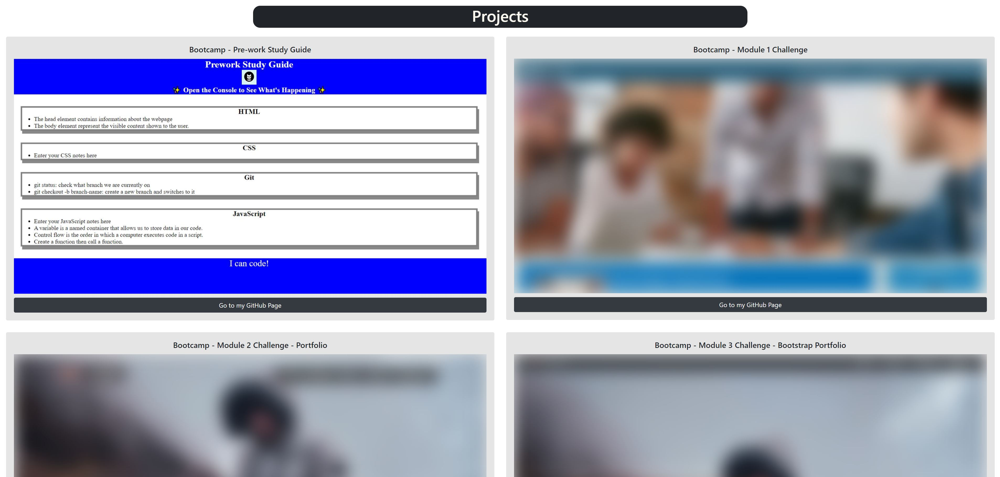
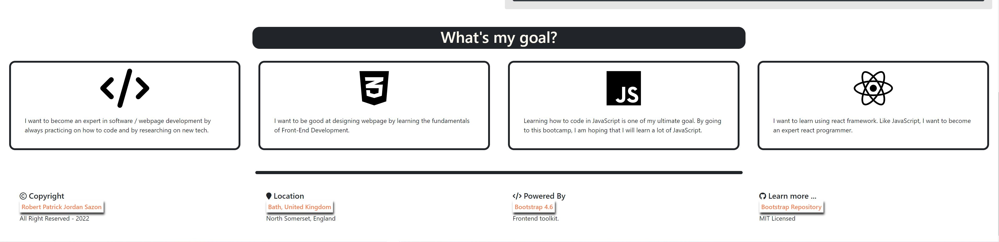

# Module 3 Challenge - Bootstrap Portfolio

## GitHub Webpage Link:
## https://rpjsazon.github.io/Bootstrap-Portolio/
---
<b>Note:</b> I intentionally mispelled the word "Portfolio" to "Portolio" to give it a unique name.

---

## How I build my first bootstrap ( responsive ) webpage?

### 1. I added a Nav and customized the color.

Reference: https://getbootstrap.com/docs/4.6/components/navs/

* I added the logo style and hover effect when cursor point on the links.

### 2. By adding jumbotron, I makes the website interesting.

Reference: https://getbootstrap.com/docs/4.6/components/jumbotron/

* I added this style to my Jumbotron.

### 3. For my about and contact section, I created (1) div class "row" and add (3). One for my photo and then nested two column and set it as "d-block" (display="block") in bootstrap to achieved this look.

Reference: https://getbootstrap.com/docs/4.6/components/card/

### 4. Adding bootstrap card is easy. Just make sure you put the grid layout correctly.

Reference: https://getbootstrap.com/docs/4.6/components/card/

* I added blur effect when hovering to the cards.
* For future development, I will add a carousel to make it more interesting.

### 5. Skill Cards and Footer

Reference: https://getbootstrap.com/docs/4.6/components/card/

### Icons

Reference: https://kit.fontawesome.com/2b5875a855.js